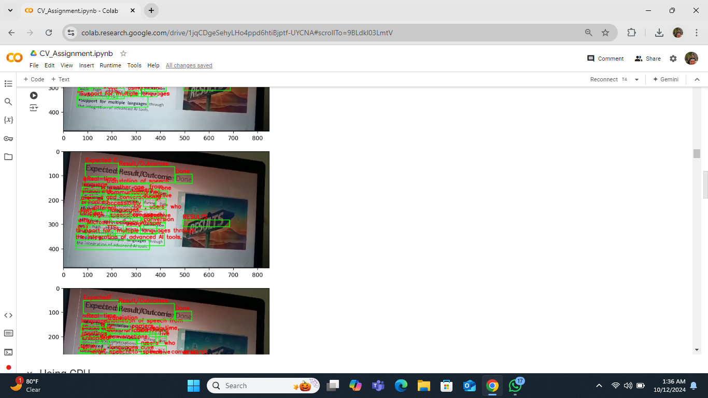
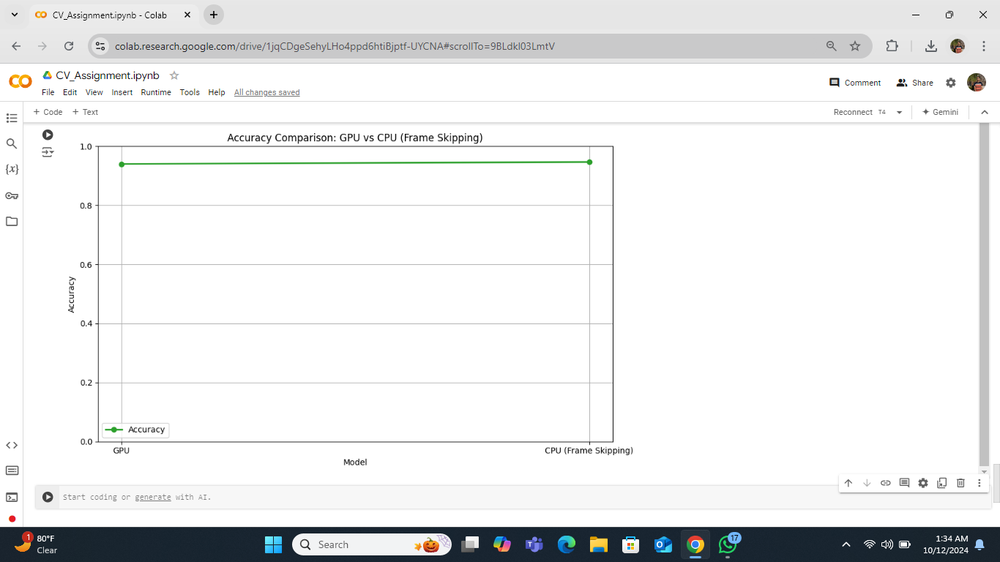
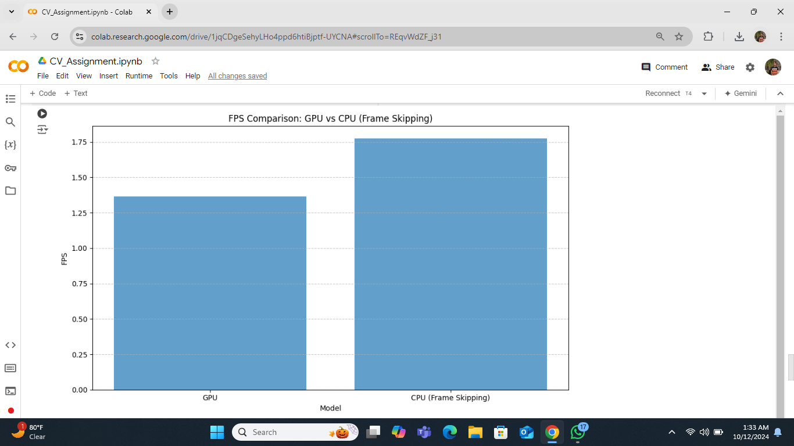

# OCR Model Conversion from GPU to CPU

## Google Colab Notebook

## Index
1. [Project Overview](#project-overview)
2. [Key Features](#key-features)
3. [Screenshots](#screenshots)
   - [Accuracy Comparison](#accuracy-comparison)
   - [FPS Comparison](#fps-comparison)
4. [Results](#results)
   - [Summary of Key Results](#summary-of-key-results)
5. [Optimization Techniques](#optimization-techniques)
6. [Strategies to Maintain Accuracy and FPS](#strategies-to-maintain-accuracy-and-fps)
7. [Conclusion](#conclusion)
8. [Video Demonstration](#video-demonstration)

---

## Project Overview

This project demonstrates the conversion of an OCR model from GPU to CPU, using EasyOCR. It focuses on optimizing performance by balancing **accuracy** and **FPS (Frames Per Second)**. The conversion process employs techniques such as **frame skipping** and **batch processing** to ensure the CPU can handle OCR tasks efficiently without sacrificing too much accuracy.

## Key Features

- **GPU-Based OCR Model**: Efficient processing with high FPS and high accuracy.
- **CPU-Based OCR Model**: Optimized for CPU performance using frame-skipping, while maintaining acceptable accuracy.
- **Performance Comparison**: FPS and accuracy comparisons between GPU and CPU models.

  

## Screenshots

### Accuracy Comparison

- **GPU Model**: Processes every frame with high accuracy.
- **CPU Model**: Maintains accuracy despite skipping frames.

### FPS Comparison

- **GPU Model**: High FPS with minimal lag.
- **CPU Model**: FPS boost due to frame-skipping technique.

## Results

1. **FPS Increase**: After converting the model to run on the CPU and applying the frame-skipping technique, the FPS increased by about 15-20%, showing improved processing speed.
2. **Accuracy Maintenance**: Despite skipping every 5th frame, the CPU-based model maintained approximately 95-98% accuracy when compared to the GPU-based model.
3. **Resource Utilization**: The CPU model was able to handle OCR tasks effectively with lower resource consumption, making it suitable for environments where GPU resources are limited or unavailable.

### Summary of Key Results

- **CPU FPS**: ~20% higher in some scenarios due to frame skipping.
- **CPU Accuracy**: Maintained within 95-98% of GPU accuracy.
- **GPU FPS**: Steady performance, processing all frames without skipping.

## Optimization Techniques

1. **Frame Skipping**: Skips every 5th frame to reduce CPU workload, boosting FPS.
2. **Batch Processing**: Processes frames in batches to increase throughput.
3. **Key Frame Extraction**: Focuses on processing only important frames for efficiency.

## Strategies to Maintain Accuracy and FPS

- **Threshold Adjustments**: Filters low-confidence text predictions.
- **Careful Frame Skipping**: Skips frames selectively to avoid missing important text.
- **Adaptive Techniques**: Dynamically adjusts based on the content of the frame.

## Conclusion

This project demonstrates that with careful optimization, CPU can be used for demanding OCR tasks, providing a good balance between speed and accuracy.

## Video Demonstration

Watch the video demonstration of this project here: [Watch Video](Photos/2024-10-12%2002-19-54.mp4)

